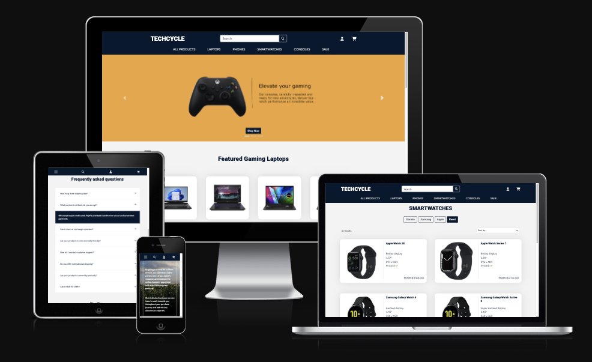
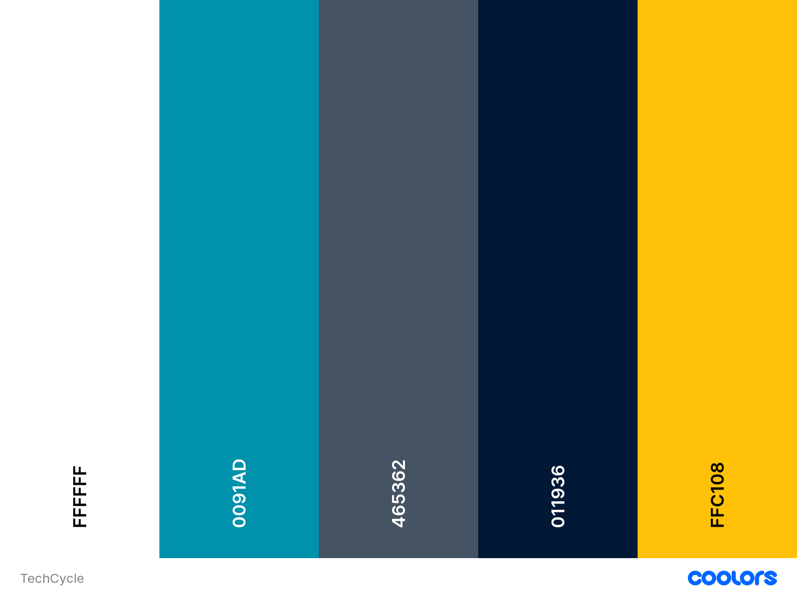
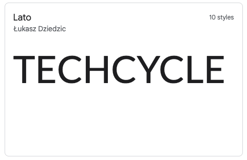
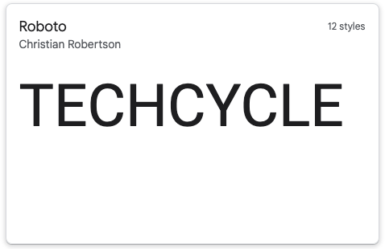
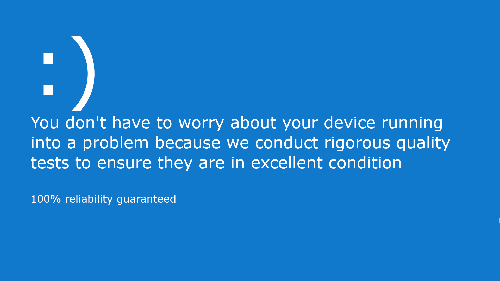

# TechCycle 

TechCycle is an e-commerce platform for selling refurbished electronics. The website is fully responsive and can be navigatig easily and comfortably on every screen sizes. I aimed to make the interface intuitive and engaging. Agile methodology was used for planning and designing throughout the development process. The database schema used for this project was carefully planned to achieve what I envisioned at the initial planning stages. CRUD functionally is implemented and can be done in the front-end. Users of the website are able to register to the website for a faster and more comfortable checkout system, as well as for having the ability to look through their order history. The main functionality is of course the checkout system, which lets people order any product from the website. User actions are reflected throughout the website to make the experience even more flawless.

For version control, GitHub was used. The repository can be found here: [GitHub repository](https://github.com/GaborFicsor/techcycle)

For the admin panel, the default Django admin dashboard was used, where the admin is able to perform CRUD functionalities related to every object.

The live website hosted on Heroku, can be found here: [TechCycle](https://techcycle-66d1b58854d4.herokuapp.com/)




## CONTENTS

* [Project Purpose](#project-purpose)
* [Business Model](#business-model)
  * [Target audience](#target-audience)
  * [User experience](#user-experience)
  * [Secure payments](#marketing)
  * [Marketing](#marketing)
* [Client Goals](#client-goals)
* [User Stories](#user-stories)
* [Agile Development](#agile-development)
* [Design](#design)
* [Design Thinking](#design-thinking)
  * [Colour scheme](#colour-scheme)
  * [Typography](#typography)
  * [Imagery](#imagery)
    * [Carousel Slides](#carousel-slides)
    * [Forest background](#forest-background)
    * [Product images](#product-imags)
    * [Miscellaneous](#miscellaneous)
  * [Wireframes](#wireframes)
  * [Database and ERD](#database-and-erd)
* [Features](#features)
  * [The landing page](#the-landing-page)
  * [The product cards](#the-product-cards)
  * [The detailed product page](#the-detailed-product-page)
  * [The bag](#the-bag)
  * [The checkout and checkout success](#the-checkout-and-checkout-success)
  * [Items on sale](#items-on-sale)
  * [Registering](#registering)
  * [Superuser capabilities and CRUD](#superuser-capabilities-and-crud)
    * [Creating a new product](#creating-a-new-product)
* [Future implementations](#future-implementations)
* [Technologies used](#technologies-used)
  * [Languages Used](#languages-used)
  * [Frameworks, libraries and other external tools](#frameworks-libraries-and-other-external-tools)
  * [Validators](#validators)
* [Deployment](#deployment)
* [Testing](#testing)
* [Credits](#credits)
  * [Media](#media)
  * [Acknowledgments](#acknowledgments)
## Project purpose

The fifth and final project of Code Institute's Diploma in Software Development focuses on the development of an E-commerce Application. This comprehensive Full-Stack web application has been designed to incorporate business logic and essential aspects such as search engine optimization and web marketing techniques. A considerable amount of planning and design thinking has been involved during development to achieve a seamless user experience and provide an accessible and intuitive user interface that makes navigating and perfoming the necesearry actions feasible. The project uses Python as a main language with the Django web framework for creating efficient functionality. For providing convenient payment gateway for customers Stripe payments have been integrated. The project also utilizes Amazon Web Services for hosting media files.

## Business Model

TechCycle is a B2C e-commerce platform that follows a customer centric business model providing a pleasant shopping experience for it's users. In this type of business model customers are making single payments. The web application connects customers directly with the online marketplace while offering competitive and affordable prices while providing good value in exchange. The website aims to give customers access to more product categories at once. Selecting an item, adding it to the bag and proceeding to the checkout is easy and intuitive. The products sold on this website have clear desciprionts and images to make the user know what they are paying for. While the website meant to be selling 4 categories of products, there is an undeniable emphasis on the laptop product's amount of detail and description. To make the platform even more appealing to customers, free shipping and 12 month warranty comes with each and every product.

### Target audience

This project's target audience are customers who looking to purchase a wide range of products, mainly electronics. The website aims to offer a high quality and variety of products with multiple choices for conditions that can lower the price of the items and making them more affordable. The products are second hand refurbished electronincs that go through careful inspections to meet several criteria such as, functionality, performance, software, hardware, battery and appearance. Customers are made aware of the conditions and possible minor flaws of a product they purchase.

### User Experience

The main goal of this website is to create an e-commerce platform where people can purchase products to their liking. Navigating the website is straightforward and the users do not have to spend unnecesarrily long amounts of time between selecting a product, putting it to the cart and then purchasing it.

Users can select more than one item to put in their bag and purchase them, although that amount depends on the inventory stock count. An estimated stock amount is reflected in the front-end to help users with making their decision.

Registering to the website will give people the ability to save their checkout information so that the next time they want to purchase something, the checkout process becomes even easier for them. Registered users can save their details at the checkout, or they can add them manually in the profile page. The profile page also holds information for the user's detailed order history. Customers visiting this website don't need to rely on any external help or guidance to make their own choice.

### Secure payments

The platform includes a secure checkout system provided by stripe payments. Stripe offers an easy payment gateway and good security measures to make sure the customers payment informations are always protected.

### Marketing


For expanding the business model and finding ways to attract customers we can create our business marketing website where we keep customers updated about our latest price changes, stock availabilities and discounts. This is an easy way to connect with customers and adapt the business model to the trends and make the business even more model profitable. Creating a marketing page for our business also allows our brand to establish an online presence. It makes a convenient solution for keeping in connection with out target audience, and gives us the ability to let customers know about the most up-to-date information.


## Client Goals

<hr>

* To have an immediate understanding of what the website's purpose is.
* To create the layout enjoyable on every screen size without any distortions that would lower the quality or usability of the website
* To give users the ability to view a range of different products
* To give users the ability to pay for their selected product

## User Stories

<hr>

***As a site User***

* I want to be able to view a range of products on the website
* I want to be able to select an item from a variety of products
* I want to be able to search for a product I'm interested in
* I want to be able to filter the products to get the best results to choose from
* I want to be able to easily identify deals or special offers
* I want to be able to put items in my shopping cart
* I want to be able to adjust my shopping cart contents if I changed my mind
* I want to be able to proceed to checkout when I'm confident with my decision
* I want to be able to pay for the items in my shopping cart
* I want to be able to receive feedback for successful actions
* I want to be able to view a summary of my purchase

***As a site Admin***

* I want to be able to log in to the site admin panel securely
* I want to be able to manage user accounts with crud functionalities
* I want to be able to manage inventories and track stock availability for each product
* I want to be able to be able to communicate with customers through email notifications
* I want to be able to have a decent overview of all the products listed on the website
* I want to be able to perform actions on more than one item at once


***As a site operator***

* I want to be able to add products easily and conveniently to the database
* I want to be able to edit existing products details if needed
* I want to be able to delete products if needed
* I want to be able to add items to the discounted items
* I want to be able to remove items from the discounted items
* I want to be able to manually update the stock count of the items


## Agile Development

To implement agile development into my Django e-commerce project, I made use of several key agile concepts. I started by breaking down my project into smaller well-defined and more manageable milestones, which helped me to stay focused and organized throughout the development process.

I created user stories with acceptance criteria and added tasks that needed to be completed to fulfil each user story. During development, I made use of the Kanban board for my project as it gives a good sense of progression. The issues that did not get closed were moved to a column called future implementations.

I think taking the time to create well-defined tasks helped put things into perspective. I spent a lot of time planning the project before I started everything else. The development process was crushing so I had to prioritise usability over everything else. MoSCoW prioritization was laid out at the beginning by attaching different labels to tasks with different priorities and I tried to meet those goals as much as I can.

<br>

## Design

### Design Thinking

Some amount of design elements have been reused from Code Institute's boutique-ado walkthrough project. These are mainly the bag, checkout and profile pages and parts of the navigation bar.

I spent a good amount of time looking up various e-commerce websites that might be similar to what I wanted to make to gather inspiration and gain an overall idea of what the most important things about the design are.

I knew the products should be easily noticeable. Initially, these items should show only the most important details to catch the user's interest.

I also tried to create a project with an environment I'm somewhat familiar with so that I could create a good design that I would appreciate as a site user.

My proudest design elements are the product cards and the footer section. I spent a lot of time planning and executing the design I envisioned. I also came up with my ideas for the carousel images and I like the blue slide which is meant to resemble the blue screen of death, except it's giving an opposite impression.

I would like to further improve the website's overall look and have a more consistent styling with and better use of screen real estate.

### Colour Scheme

<hr>

For the main colours of the design, I tried picking simple colors that go well together. I picked a dark shade of blue for the main color. The amber is used for highlighting elements on the landing page and the light blue is used for button hover effects.




### Typography

<hr>

For regular text and paragraph elements I used Lato



For headings I used Roboto




### Imagery

<hr>

#### Carousel slides

The carousel images on the landing page were all done by me with the use of gimp software.
The carousel was a little difficult to pull off because I wanted the images to not stretch beyond the bootstrap containers width so I had to create more iterations of each image and then use the srcset attribute to change them at different breakpoints for better readability.

<details>
  <summary>The console screen slides</summary>

|> 575px|576px - 991px | 991px+
:-------------------------:|:-------------------------:|:-------------------------:
| |

</details>

<details>
  <summary>The blue screen slides</summary>

|> 991px| 992px+
:-------------------------:|:-------------------------:
|
</details>

<details>
  <summary>The sale slides</summary>

|> 991px| 992px+
:-------------------------:|:-------------------------:
|

</details>

#### Forest background

<details>
  <summary>Image of a forest used as background</summary>


</details>

#### Product images and sources

For the products I looked up images for each item individually and then saved them with screenshots. I needed to find images that are somewhat similar in size, but most importantly have white background around them.

In order to make them similar to each other I needed to crop every single one to square shaped and then resized all of them to the same 500x500 px size to make them easier to work with.

A list of the product images with their source can be found at the media section.


#### Miscellaneous

<details>
  <summary>Icons</summary>

Stripe|Django|AWS
:-------------------------:|:-------------------------:|:-------------------------:
||

</details>

<details>
  <summary>Payment options icons</summary>

MasterCard|Visa|PayPal|Apple Pay
:-------------------------:|:-------------------------:|:-------------------------:|:-------------------------:
|||

</details>

### Wireframes

<hr>

<details>
  <summary>Initial desktop wireframe</summary>


</details>

<details>
  <summary>Initial phone wireframe</summary>


</details>

<details>
  <summary>Initial cards wireframe</summary>


</details>

<details>
  <summary>Initial product detail wireframe</summary>


</details>

<details>
  <summary>Initial footer detail wireframe</summary>


</details>


### Database and ERD

<hr>


During the development, one of the most difficult parts was figuring out how the models should be related. I knew I wanted to have four different kinds of products in my database. In the beginning, I tried creating
a single product model including every field I could think of. I have tried recreating my database schema several times until I figured that the model inheritance would maybe what I am looking for. So I created the Product model
as the parent class for the Laptop, Phone, Smartwatch and Console models. The parent class holds all the fields that each child class shares. For a long time, this worked, even though the more I worked on my models and templates the
more complicated and tedious the whole process got. Eventually, I got to the point where I knew I had to implement a working inventory model to the database but I didn't know how. I recreated my database schema and dropped the local database
several times. Eventually, I stumbled upon [a question on Stackoverflow](https://stackoverflow.com/questions/70974656/add-products-with-different-sizes-and-price-to-cart-django) which got me creating the database the way it is now.
This question made me realize that if I want to render a selected condition's price in the bag correctly, I have to pass in the inventory.id not the laptop.id.

The way the Products app's models work is the following:

 * Creating an object instance is made through the Laptop, Phone, Smartwatch and Console models
 * Whenever one of these model's object is being created, they inherit fields from the product model
 * After a new instance is added to the database, the Inventory model generates 3 objects for that newly created instance
   * One Inventory for the object's acceptable condition
   * One Inventory for the object's good condition
   * One Inventory for the object's excellent condition

Inventory objects are not meant to be created or deleted manually, as those are done automatically.
When the Inventory object is created the price and sale_price fields are automatically generated based on the Product's price field
The Inventory objects do not generate stock_counts however.
When a user is creating a new Laptop for example on the front end he needs to specify the price field for that Laptop which is then assigned as the best condition's price and the rest of the prices are calculated based on that. So when an item is created initially that item has no stock amount. To add stock_count numbers to a Laptop object, the user has to update that Laptop objects inventory object.

Thankfully the inheritance between the models allowed me to define class methods that I was able to use in the templates, so this is why there are a lot of functions in the Product model.

This is hard and it made production even harder because I am not sure if this is a good approach. I needed to create individual view URLs and a lot of templates for everything. This also made it very difficult to handle all product cards at once.
I could not filter the all_products view effectively. So that is why each Product category has its own template for displaying all objects. The all_products view is used for searching and displaying items on sale in my case. 

I've tried really hard to at least make it possible that I could search using a class method and got so far that I was able to at least print out the query that I entered and then print out the results for that query and it worked in the terminal, but I could not make it work in the template.


I will definitely try to find a better way for doing this because I genuinely want to find a solution. Despite all of this I think the database schema of the Products app work well. I added information notices to the front end forms to make the process understandable.

My entirely custom made models are:
 - Product
 - Laptop
 - Phone
 - Smartwatch
 - Console
 - Inventory
 - FAQ
 - Newsletter

 It is worth mentioning that data for my models was taken from kaggle.com. For the Laptop, Phone, Smartwatch and Console models I found JSON fixtures that I was able to modify to my own needs. These databases were stuffed with items and fields and I decided to create my fixtures
 based on them. This was handy because as I mentioned I had to recreate my database schema a lot of times, so having a ready set of fixtures was good because I was able to load data within seconds. This is the reason I decided to create the FAQ model because I did not want to type every FAQ every time I had to create a new database.

 I don't know if this is a good way, but it works. The most obvious flaw is the all_products view and how it is rendering the products. I could have made searching easier by adding a name field instead of brand, series and model, but that way I would not have been able to filter the objects by brand for example. I don't know what else to say.


## Features

***What are the main features of the website?***
The main features of the website:
* Viewing a list of products
* Filtering products
* Sorting products
* Searching products
* Viewing a detailed template for any product
* Creating an account
* Email verification on first login
* Logging in to the account
* Editing a profile view
* Rendering order history in the profile view
* Ability to subscribe to newsletter
* Message toasts are reflecting user actions
* Being able to select a condition and quantity for a product
* The product's price is reflected according to it's condition and quantity
* Adding and removing items from the bag
* Being able to proceed from the bag to the checkout page
* Filling out a validated form for placing an order
* Checkout process is done with integrated Stripe functionality
* Recieveing order confirmation and email
* Site operators are able to perform CRUD functionalities
* Site opeartors are able to add to or remove items from sale
* The website reflects the several ways if an item is out of stock
* Out of stock items can not be placed into the bag or purchased
* Navigating to a page that does not exist will render a custom 404 error page
* Each page can be accessed from another page and each page has a button to navigate elsewhere

### The landing page


The landing page features a bootstrap carousel with custom images that are made responsive for readability. Every slide of the carousel has a button to navigate to a different page of the website.
Below the carousel, a random sample of the Laptop model's gaming laptops are displayed. These cards are clickable and will take the user to their corresponding detailed page.

<hr>


Scrolling down on the landing page will take the users to a small section explaining why this website offers a good service. I made sure that the text is readable. Below this section, a FAQ section can be found. This is a customized bootstrap accordion. Rendering the faq section with Django for loops made less clutter on the website but I had to implement jquery functionality for closing the accordion tabs if another one opens. For this, I found a solution on [stackoverflow](https://stackoverflow.com/questions/29096037/how-to-open-and-collapse-the-same-jquery-accordion-with-click-on-it-only) which helped achieve the desired functionality.

<hr>


Immediately after the FAQ section, there is a small section of information icons that display some of the benefits of purchasing products from this website, such as free delivery, 12-month warranty and sustainability. For smaller screen sizes this section displays a dynamic text below the icons.
Navigating to the bottom of the landing page the users can find a form for joining the website's newsletter with their email addresses. Upon successfully submitting the form, the user will receive a confirmation email as well as a success toast.
At the bottom of the page is the footer section which I am really proud of, although originally I had better ideas to make it more sophisticated, I had to prioritize functionality over appearance. The footer section has links to all Laptops, Phones, Smartwatches and Consoles pages.
Users can read about the inspection procedures, conditions of the items, sustainability and the privacy policy of the website.
Navigation links are also included to take the user to the different pages of the website. On the right-hand side, small icons are displayed for letting the user know about the available payment options.
The last row of the footer displays the official icons for Stripe, Django and Amazon Web Services. These are the main technologies used during development. (These icons glow when hovered and I'm so proud of the design of this section)

Scrolling back to the top of the page the user has the ability to navigate easily with the help of the navigation bar.

Clicking either one of the Laptop, Phone, Smartwatch or Console navigation links will open a dropdown box that offers a way for sorting and filtering products. Choosing the all laptops link will take the user to a page where all the laptops are displayed with a detailed, custom-made product card.

<hr>

### The product cards


On the Laptop page users are quickly able to tell if an item they are looking at is out stock. Items that are out of stock are greyed out and cannot be placed into the bag or purchased, but their detailed page view can still be viewed.

First let's take a look at the detailed page of a Laptop if it's available

### The detailed product page


This page offers several ways to let the user know that this laptop is available for purchasing.

A few left (if the overall stock_count is 2 or less)|Available in all conditions
:-------------------------:|:-------------------------:
|

Avilable in good and excellent conditions |On sale with only a few left
:-------------------------:|:-------------------------:
|||

The price in the right top corners also reflects the lowest price this item is available for.
Scrolling down a form is displayed with 2 input fields, one for quantity and another for condition. These input fields also reflect the availability of an item.

Available in good | Available in good and excellent | Out of stock
:-------------------------:|:-------------------------:|:-------------------------:
||||

If the item is competely out of stock the form can not be submitted and both fields are disabled.
In stock | Out of stock
:-------------------------:|:-------------------------:
|||

### The bag

With all this information I think out-of-stock items can be easily identified and the user has more ways of getting information about the availability on the same page. The information is clear and users can decide what amount and condition they want to put in their bags.

Adding items to the bag will trigger a success message and display the current bag contents to the user with the option to go to the bag page. Navigating to the bag page can also be done by clicking on the cart icon.

Adding item to the bag | Adding the same item but in a different condition
:-------------------------:|:-------------------------:
 | 

Navigating to the bag we can find our selected items with their information on quantity, condition and price, here we can also remove items from the bag


### The checkout and checkout success

Proceeding to the checkout page the user finds the checkout form and a summary of their items in the bag with the order total displayed. The checkout page's security is ensured by several factors, but most importantly, the Stripe payment systems validation methods.
 - The validation of the credit card number based on length and format can easily determine the validitiy of the entered information.
 - Checking for the expiry date of the credit card being used.
 - CVC validation to match the required format and length
 - Postal code validation based on the associated credit card number

 Any data passed as invalid will result in a failed payment with notifying the user to make sure their entered data is indeed valid. For testing the creation of payment intent and achieveing succesfully processed payments I have used a Visa test card number provided by Stripe.
 Entering 4242-4242-4242-4242 with any combination of CVC and any combination of future date's are validated and could be trusted and safely used for testing purposes.
 Additional validation was implement by making sure the product amount placed in the bag can not exceed the amount of that product's stock count. Trying to purchase more that the available product count will result in an unsuccessfull checkout.


Completing a valid form will take the user to the checkout success page where a detailed overview of the order can be viewed. The user now has the option to go back to the homepage or navigate elsewhere with the help of the navigation bar.
Stripe payment systems has several ways for providing a secure environment for online payments.


### Items on sale

The user can navigate to the sale page where the products that are currently on sale can be viewed. This page can also be reached from the landing page carousel.


### Registering

Users can register to the website and they can do so by navigating to the top right corner of the navigation bar and clicking on the person icon.
Here we can decide to sign in or sign up if we don't have an account yet.


For demonstrating purposes I am using a temporary email here because my email is already registered to the website. First we need to fill out the form and then we press the Sign Up button we are taken to a page that tells us that we need to verify our email address and for this purposes a verification link was sent to the email address I added in the form.


After we click the link provided in the verification email we are taken to the confirm_email page where we have to press confirm to proceed.


With everything done now we are able to go to our profile page where we can save our default data for autofilling the checkout form for future purchases. We can also see a list of our order history on the right.


### Superuser capabilities and CRUD

If we are logged in to the website as a superuser we can find navigation links to adding new products to the database. These actions are not available for regular users or site visitors.


#### Creating a new product

As mentioned earlier, instructions are provided for understanding how the process of adding a new product to the database works.


After we've added a new Laptop to the database, we are redirected to the newly added Laptop's detail view. Here we can edit the Laptop's details and it's inventory.


Here we select edit and we are taken to the Laptop's editing page where the forms is prepopulated with the Laptop's details.

Here are the main details of the Laptop (these fields are inherited from the product model)


And here are the additional details unique to the Laptop model's objects


Here we can save our changes and go back to the Laptop's detailed page or we can navigate back to this page's top where we can find the edit inventory button.


Here we can see that we are only able to modify the stock count numbers because the rest of the fields are auto-generated and we must not edit them manually.

We're not only able to create or update existing data but we can also delete from the database on the front end. If we want to delete a Laptop for example, we just have to navigate to a Laptop's detailed page where we can find the previously mentioned edit button and also a red delete button. Pressing the red button won't immediately delete the Laptop but make a modal pop up on the screen that asks us to confirm our intentions. This was implemented as a defensive design and to prevent products from removing by accident.


## Future Implementations

* Implementing a load-more button at the bottom of the screen to render more products as the user scrolls down
* Create better and more detailed information pages, and include information about shipping, returns and warranty
* Adding page for detailed contact information.
* Adding functionality for sending an email to the users if an item is back in stock
* A fully working front-end control panel that holds all crud functionalities, and can create lists and export data about sales and trends.

I think the most important functionalities have been implemented already but there are a lot that I would like to change, but those are mostly frontend and design related. Some parts of my project feel rushed and I would like to spend more time on this project and come back later to create more efficient code or refactor as much as I can. 
In the future, I would like to add different variations to the same products where not only the condition but the hardware specifications can be selected as well each selection manipulating the price.
I would also like to create a more consistent styling for this webpage.
The only validation for the quantity of a product in the bag is performed during the checkout process. This way I can make sure that customers can not exceed the maximum amount of a product's stock amount, but there needs to be a better way for doing this rather than telling the user in the last minute that what they are trying to buy is not available.


## Technologies Used

### Languages Used

* HTML
* CSS
* JavaScript
* Python


### Frameworks, libraries and other external tools

<hr>

* [Stripe](https://stripe.com/) - handling payment 
* [Django](https://www.djangoproject.com/#:~:text=Django%20is%20a%20high%2Dlevel,needing%20to%20reinvent%20the%20wheel.) - rapid development and maintaining the database of the website
* [Amazon Web Services](https://aws.amazon.com/) - storing static files on the web
* [Django Allauth](https://django-allauth.readthedocs.io/en/latest/) - user authorization and authentication
* [Gunicorn](https://gunicorn.org/) - HTTP requests and to run a Python web application
* [Psycopg2](https://pypi.org/project/psycopg2/) - PostgreSQL enginge
* [ElephantSQL](https://www.elephantsql.com/) - storing database on the web
* [Bootstrap 4.6.2](https://getbootstrap.com/docs/4.6/getting-started/introduction/) - accelerated styling and responsiveness of the website
* [jQuery](https://jquery.com/) - handling dom events, and sending data to Stripe
* [Git](https://git-scm.com/) - version control
* [GitHub](https://github.com/) - storing the project repository
* [Gitpod](https://gitpod.io/) - as an IDE for creating the project
* [Heroku](https://dashboard.heroku.com/) - hosting the project on the web
* [Balsamiq](https://balsamiq.com/) - creating wireframes of the initial design elements
* [Coolors](https://coolors.co/generate) - visual representation of the colours used on the page
* [Favicon](https://favicon.io/) - for creating the favicon for the website
* [Picresize](https://picresize.com/) - resizing images
* [Squaremyimage](https://squaremyimage.com/) - for modifying the product images
* [Gimp](https://www.gimp.org/) - creating the carousel images
* [Google Fonts](https://fonts.google.com/) - Lato and Robot fontstyles
* [Font Awesome](https://fontawesome.com/) - using icons
* [Pexels](https://pexels.com) - the forest background image
* [Django Crispy Forms](https://django-crispy-forms.readthedocs.io/en/latest/) - for better looking forms
* [Crispy Bootstrap 4](https://django-crispy-forms.readthedocs.io/en/latest/form_helper.html) - for styling crispy forms
* [Pillow](https://pypi.org/project/Pillow/) - image processing
* [LucidChart](https://lucidchart.com/) - creating erd model 
* [flaticon](https://www.flaticon.com/) - small icons displayed in the footer section
* [iconscout](https://iconscout.com/) - small payment icons
* [XML sitemaps](https://www.xml-sitemaps.com/) - generating a sitemap for the project
* [Kaggle](https://www.kaggle.com/) - JSON fixtures


Manual testing results are documented in the [TESTS.md](../techcycle/TESTS.md)

### Validators

<hr>

* [W3C Markup Validation](https://validator.w3.org/)
* [W3C Jigsaw](https://jigsaw.w3.org/css-validator/)
* [JSHint](https://jshint.com/)
* [CI Python Linter](https://pep8ci.herokuapp.com/)


<br>

## Deployment

1. Navigate to [GitHub](https://github.com/) in the browser
2. Open the [Code Institute Full Template](https://github.com/Code-Institute-Org/ci-full-template) provided by [Code Institute](https://codeinstitute.net/ie/)
3. Click **'Use this Template'** button and select **'Create a new repository'**
4. Enter a name for the project and an optional description
5. Click the **'Create Repository from Template'** button
6. Once the repository is created we can open a new workspace with [Gitpod](https://gitpod.io/workspaces/) in 2 ways:
    1. Install [Gitpod - Always ready to code](https://www.gitpod.io/docs/configure/user-settings/browser-extension) Google Chrome extension
        * If we added this extension to our Google Chrome browser, a green 'Gitpod' button will show up in our newly created repository
        * Clicking this button will generate a new workspace with Gitpod's [integrated development environment](https://en.wikipedia.org/wiki/Integrated_development_environment) where we can start working on our project
    2. Or we can use our GitHub repository's URL
        * Copy the repository URL from the browser
        * Enter gitpod.io/# in the browser and change the '#' symbol to our GitHub repository's URL

<br>

7. When the workspace is up and running we need to set up our Django environment first, to do that:
    1. Install Django by entering the following in the terminal: 
        ```
        pip3 install 'django<4'
        ```
    2. Install [psycopg2](https://pypi.org/project/psycopg2/) PostgreSQL database adapter, by entering the following in the terminal: 
        ```
        pip3 install dj3-cloudinary-storage
        ```
    3. We need to add every supporting dependency to a **'requirements.txt'** file by entering the following in the terminal after a dependency like **psycopg2** has been installed:
        ```
        pip3 freeze --local>requirements.txt
        ```
    4. Create our project by entering the following in the terminal:
        ```
        django-admin startproject 'PROJECT_NAME' .
        ```
        > replace **'PROJECT_NAME'** with our desired name for the project, also don't forget to add the '.' at the end of the command.
    5. Create a new App by entering the following in the terminal:
        ```
        python3 manage.py startapp APP_NAME
        ```
        > replace the **'APP_NAME'** with the desired name for the app
    6. After the app has been created and shown up in our local directory, we need to add the app to the **INSTALLED_APPS** list in our **PROJECT_NAME** folder's **SETTINGS.py** file
    7. After our **APP_NAME** has been added to the **INSTALLED_APPS** enter the following in the terminal: 
        ```
        python3 manage.py makemigrations
        ```
        followed by
        ```
        python3 manage.py migrate
        ```
        > this will create our skeleton django project
    8. To see how our django skeleton project looks rendered in the browser, we need to add ```'localhost'``` to the **ALLOWED_HOSTS** in our **PROJECT_NAME** folder's **SETTINGS.py** file
    9. Now we can run a local server with the following entered in the terminal:
        ```
        python3 manage.py runserver
        ```
    10. Click **Open Browser** to see the rendered application in the browser

<br>

8. For deploying the website we need to set up [Heroku](https://heroku.com/) cloud platform service
    1. Create a new account on Heroku and connect it with our GitHub account
    2. Sign in to our Heroku profile
    3. Click on **'New'** and select **'Create new app'**
    4. Name the app and choose the region(select Europe)
    5. Once the app is created, navigate to the **Settings** tab and add the following Buildpack:
        * **'heroku/python'**
    6. Then add the following Config Vars:
        * **PORT** : **8000**
        * **SECRET_KEY** : **YOUR_SECRET_KEY**
        * **DISABLE_COLLECTSTATIC** : **1**
    7. Also, in **SETTINGS.py**, add ```'your-project-name-on-heroku.herokuapp.com'``` to **ALLOWED_HOSTS** list, where ```localhost``` have been already added previously

<br>

9. Our Django database is only accessible within the local environment and is not suitable for production enviroment. The deployed project on a hosting service will not be able to access it, so we need to use [ElephantSQL](https://www.elephantsql.com/) To use this service:
    1. Create an ElephantSQL account
    2. Click on **'+Create New Instance'**
    3. Set up plan
        * Name: **'YOUR_PROJECT_NAME'**
        * Plan: **'Tiny Turtle (free)'**
    4. Select region
        * Data center: **'EU West-1 (Ireland)'** 
    5. Click on **Review**
    6. Click on **Create Instance** 
    7. In the ElephantSQL dashboard, click on the newly added database
    8. Copy the URL with the button provided
    9. Add URL to the Heroku Config Vars
        ```
        DATABASE_URL: YOUR_DATABASE_URL_FROM_ELEPHANT_SQL
        ```

<br>

10. For storing our static files we need to use Amazon Web Services
    1. Creat a new account after navigating to [AWS](https://aws.amazon.com/)
    2. Sign in to the AWS Management Console and search for service: S3
    3. Open S3 and create a bucket which will be used for storing our files
    4. Select the closest region
    5. Select ACLs enabled and Bucket owner preferred
    6. Uncheck block all public access to make our bucket public
    7. Click creat bucket
    8. On bucket properties navigate to static website hosting
    9. Turn on static website hosting
    10. On the permissions tab
        1. Set up CORS configuration
        2. Paste the following into the **Cross-origin resource sharing (CORS)** section:
        ```
        [
          {
            "AllowedHeaders": [
                "Authorization"
            ],
            "AllowedMethods": [
                "GET"
            ],
            "AllowedOrigins": [
                "*"
            ],
            "ExposeHeaders": []
          }
          ]
        ```
    11. Create a security policy for our bag with the AWS Policy Generator
      1. Select S3 Bucket Policy
      2. Allow all principals by using a * character
      3. For the actions, select **GetObject**
      4. Copy Amazon Resource name from the management console
      5. And paste it into the arn box
      6. Click add statement, then generate policy
      7. Copy the policy into the bucket policy generator
      8. Select list object permissions for everyone in the access control list tab
    12. Navigate to IAM services and create a group for our project
    13. Navigate to creating policy and import S3 full access policy
    14. Copy the bucket arn and paste it in the IAM create policy JSON editor
    15. Give a name and a description to our policy, then click create policy
    16. Attach policy to our group
    17. Create a user and add them programatic access

<br>  

11. Create a new file in our local directory and name it **env.py**
      1. Add **env.py** to the **.gitignore** file, to make sure it is not pushed to github as this file holds sensitive data
      2. at the top: 
          ```
          import os
          
          os.environ["CLOUDINARY_URL"] = "YOUR_COPIED_CLOUDINARY_URL"
          os.environ["DATABASE_URL"] = "YOUR_DATABASE_URL_FROM_ELEPHANT_SQL"
          ```
      3. We need to make our Django project aware of our **env.py**, to do this, we need to add the following at the top of **SETTINGS.py**:
          ```
          import os

          import dj_database_url
          if os.path.isfile('env.py'):
          import env
          ```
      4. Now that this is done we can add our secret key to **env.py**
          ```
          os.environ["SECRET_KEY"] = "YOUR_SECRET_KEY"
          ```
      5. Then in **SETTINGS.py** ,add:
          ```
          SECRET_KEY = os.environ.get('SECRET_KEY')
          ```
      6. Find the **DATABASES** variable in **SETTINGS.py** and comment out the url above it and the **DATABASES'**  dictionary entirely
          > The reason for doing this is because the commented out code connects our Django application to the created db.sqlite3 database within our repository. However, as we know, that database is not suitable for production.
      7. To replace the commented out code, add the following:
          ```
          DATABASES = {'default': dj_database_url.parse(os.environ.get("DATABASE_URL"))}
          ```
      8. Finally, it's now safe to save our changes, and push it to our repository in GitHub, to do this enter the following in the terminal:
            ```
            git add .

            git commit -m "Add your commit message here"

            git push
            ```

12. To push the changes to Heroku and make our initial deployment we need to create a file, called **Procfile** in our local directory, and add the following to it:
    ```
    web: gunicorn steezyspatula.wsgi
    ```
13. On Heroku, select our project and Navigate to the Deploy tab and select GitHub as the Deployment method
14. Click Connect to GitHub
15. With our GitHub profile selected, search for the correct GitHub repository and click "Connect"
16. Once the connection is done, select Enable Automatic Deploys (to make sure Heroku rebuilds the latest version after the final changes have been pushed to GitHub)
17. Finally select Deploy Branch in Manual deploy to make the initial deployment. (Automatic deploys work only after this step.)
18. Now that our Django environment is up and running, we can start working on our project by following Django's [MVT(Model View Template)](https://www.geeksforgeeks.org/django-project-mvt-structure/) structure
    > every time we want to create a view we need to do 3 things:
    1. Create the **view** in the **APP_NAME** directory's **views.py** file
    2. Create the **url path** for the **view** in the **APP_NAME** directory's **urls.py** file
    3. Create the **template** for the **view** to render in the specified **url path**, these are our custom html files added to our project's template folder in the root directory
19. We can now add models to our project within our **APP_NAME** folder's **models.py** file
    > every time we create, update or alter a model, or any field within our model we need to **save**, and type the following to the terminal:
    ```
    python3 manage.py makemigrations
    ```
    > this will create a migration file with the applied changes to the database model
    ```
    python3 manage.py migrate
    ``` 
    > this will apply the changes to our database model

## Forking


1. Login to GitHub profile
2. Navigate to [this repository](https://github.com/GaborFicsor/steezy-spatula)
3. Navigate to the top right corner of the sceen, and click on the **'Fork'** button
4. Select **Create new fork**
5. Once the process is complete, you will be redirected to the newly forked repository

<br>

## Cloning


1. Login to GitHub profile
2. Navigate to [this repository](https://github.com/GaborFicsor/steezy-spatula)
3. Click on the green **'Code'** button
4. Click on the clipboard icon to copy
5. In [Gitpod](https://gitpod.io/workspaces/), click on the green button **'New Workspace'**
6. Enter the following in the terminal:
   ```
   git clone <repository_copied_to_clipboard>
   ```
7. Press Enter to generate local clone.

<br>

## Testing

Accessibility testing, responsiveness testing validating and manual testing can be found in [TESTS.md](../techcycle/TESTS.md)

<br>

## Credits
- [How to open and collapse the same JQuery accordion with click on it only](https://stackoverflow.com/questions/29096037/how-to-open-and-collapse-the-same-jquery-accordion-with-click-on-it-only) - used for collapsing the accordion on the home page
- [How can I change the way a boolean prints in a django template?](https://stackoverflow.com/questions/845901/how-can-i-change-the-way-a-boolean-prints-in-a-django-template) - used for displaying Yes and No instead of True and False on the product detail views
- [How do I make a placeholder for a 'select' box?](https://stackoverflow.com/questions/5805059/how-do-i-make-a-placeholder-for-a-select-box) - used for disabling the add to bag form on the product detail pages if an item is out of stock
- [Django: How to reduce stock quantity when an order is made?](https://stackoverflow.com/questions/65216808/django-how-to-reduce-stock-quantity-when-an-order-is-made) - used for reducing the stock_count in the checkout view
- [Add products with different sizes and price to Cart | Django](https://stackoverflow.com/questions/70974656/add-products-with-different-sizes-and-price-to-cart-django) - helped understanding how my models should work
- [Advanced Form Rendering with Django Crispy Forms](https://simpleisbetterthancomplex.com/tutorial/2018/11/28/advanced-form-rendering-with-django-crispy-forms.html) - helped setting up the crispy forms the right way
- [Removing brackets and quotes from list in django template?](https://stackoverflow.com/questions/68658289/removing-brackets-and-quotes-from-list-in-django-template) - helped rendering the conditions in the product detail views without the brackets
- [Django values_list vs values](https://stackoverflow.com/questions/37205793/django-values-list-vs-values) - helped returning single values instead of tuples in products/models.py
- [Setting up foreignkeys in loaddata for Django](https://stackoverflow.com/questions/33554401/setting-up-foreignkeys-in-loaddata-for-django) - helped understand how to configure my json fixtures to load them properly
- [Bootstrap navbar toggler(hamburger) color change [CSS]](https://www.youtube.com/watch?v=K41tQGwijNc) - helped changing color of the navbar icon
- [Responsive images](https://developer.mozilla.org/en-US/docs/Learn/HTML/Multimedia_and_embedding/Responsive_images) - helped understanding the proper use of the srcset attribute
- [https://www.letscodemore.com/blog/django-inline-formset-factory-with-examples/](https://www.letscodemore.com/blog/django-inline-formset-factory-with-examples/) - helped understand the proper way to use formsets for creating the inventoryform
- [https://buildatscale.tech/model-inheritance-in-django/](https://buildatscale.tech/model-inheritance-in-django/) - django model inheritance


### Media

<hr>
Product image sources:

1. Laptops

* [ASUS VivoBook 15 M515DA-BQ722WS](https://cdn.mall.adeptmind.ai/https%3A%2F%2Fmultimedia.bbycastatic.ca%2Fmultimedia%2Fproducts%2F500x500%2F163%2F16345%2F16345249.jpg_large.webp)
* [DELL G15 5511 SE](https://www.luluhypermarket.com/cdn-cgi/image/f=auto/medias/1983509-01.jpg-1200Wx1200H?context=bWFzdGVyfGltYWdlc3wyNDU3NTV8aW1hZ2UvanBlZ3xhRFl4TDJneE5DOHhORFEwTmpFME5qZzNPVFV4T0M4eE9UZ3pOVEE1TFRBeExtcHdaMTh4TWpBd1YzZ3hNakF3U0F8ODA2MjFmNjg3Mzc4NTYyNDNiN2FhNzQxNWNlOTY2NmY3ODc4MzI4MGU0NmIyYzE1ZDhjODQxMzhhYWIyM2ExYw)
* [ASUS ExpertBook P1511CEA](https://www.tradeinn.com/f/13896/138967032_2/asus-expertbook-p15-15.6-i5-1135g7-16gb-512gb-ssd-%D0%9D%D0%BE%D1%83%D1%82%D0%B1%D1%83%D0%BA.jpg)
* [ASUS VivoBook 13 Slate OLED](https://storage.googleapis.com/stateless-creative-it-ie/2023/03/02e7889a-e2e360713c184abdba8c14d87d076d3d-scaled.jpg)
* [Lenovo IdeaPad 14ITL6](https://www.notebookcheck.net/fileadmin/Notebooks/Lenovo/IdeaPad_3_14ITL6-82H700CCGE/4zu3_Lenovo_Ideapad3_14ITL6.jpg)
* [MSI Modern 14 B4MW-423IN](https://www.notebookcheck.net/uploads/tx_nbc2/MSIModern14-B4MW__1_.JPG)
* [DELL Vostro 3400 (i5)](https://www.buyitdirect.ie/Images/VOSTRO-11THGEN_1_LargeProductImage.jpg?v=1)
* [MSI GF63 Thin 10SCXR-1616IN](https://pisces.bbystatic.com/image2/BestBuy_US/images/products/6537/6537558_sd.jpg;maxHeight=640;maxWidth=550)
* [Apple Macbook Pro M1 2021](https://store.storeimages.cdn-apple.com/4668/as-images.apple.com/is/refurb-mbp16-space-m1-2021_GEO_IE?wid=1144&hei=1144&fmt=jpeg&qlt=90&.v=1643239921000)
* [Apple MacBook Air M1 2020](https://www.stapletonselectrical.ie/wp-content/uploads/2021/04/48194806546462_800x.jpg)
* [Lenovo ThinkPad E15](https://storage.googleapis.com/stateless-creative-it-ie/2022/04/7113ae1c592e54329c6fdaf16adb2bf3.jpg)
* [DELL Inspiron 5518](https://www.notebookcheck.net/fileadmin/Notebooks/Dell/Inspiron_15_5518-2X3JR/4zu3_Dell_Inspiron_15_5518.jpg)
* [HP Pavilion Gaming 15-EC2048AX](https://hniesfp.imgix.net/8/images/detailed/298/15-dk2017na-win11.jpg?fit=fill&bg=0FFF&w=1500&h=1000&auto=format,compress)
* [ASUS TUF Gaming F15 FX506LH-HN258T](https://cdn11.bigcommerce.com/s-8ek7z3h3jn/images/stencil/590x590/products/8962/49737/asus-asus-tuf-gaming-f15-or-intel-core-i5-or-8gb-ram-or-512-ssd-or-fx506hf-hn001w__57482.1687842196.jpg?c=1)
* [HP Pavilion Gaming 15-EC2150AX](https://m.media-amazon.com/images/I/51D0RrFXFEL._AC_UF1000,1000_QL80_.jpg)
* [DELL Inspiron 3511](https://m.media-amazon.com/images/I/611fjdipEeL.jpg)
* [ASUS VivoBook X413EA-EB532WS](https://m.media-amazon.com/images/I/71-Cn2ER3BL._AC_UF894,1000_QL80_.jpg)
* [DELL G15 5515](https://www.notebookcheck.net/fileadmin/Notebooks/Dell/G15_5515/4zu3_Dell_G15_5515.jpg)
* [Acer Aspire 3 A315-57G](https://static2-ecemea.acer.com/media/catalog/product/_/_/___a__aspire-3-a315-58-a315-58g-sv_1000main_nx.addek.00m.png?optimize=high&bg-color=255,255,255&fit=bounds&height=500&width=500&canvas=500:500&format=jpeg)
* [ASUS VivoBook K15 OLED](https://images-eu.ssl-images-amazon.com/images/I/71vTtY1qJXL._AC_UL600_SR600,600_.jpg)
* [Acer Predator Helios 300](https://m.media-amazon.com/images/I/81g7AiqWrtL.jpg)
* [ASUS ROG Strix G513QE-HN108T](https://www.buyitdirect.ie/Images/G513QE-HN029T_12_Supersize.jpg?v=2)
* [Lenovo Ideapad Slim 3i](https://images-na.ssl-images-amazon.com/images/I/61s7sJEpsVL.jpg)
* [ASUS VivoBook Pro 16X OLED](https://storage.googleapis.com/stateless-creative-it-ie/2022/07/a4dcf1de-aa41543def44cb53b06ab67724c659e9.jpg)
* [DELL Vostro 3400 (i3)](https://m.media-amazon.com/images/I/51jjwxcW1pL._AC_UF1000,1000_QL80_.jpg)
* [Infinix X1 XL12](https://m.media-amazon.com/images/I/61DVZ7M+9FL._AC_UF1000,1000_QL80_.jpg)
* [ASUS TUF Gaming A15 FA566IC-HN008T](https://www.greenit.ie/wp-content/uploads/2022/12/ASUS-TUF-Gaming-A15-2.png)
* [HP 15s du3060TX](https://m.media-amazon.com/images/I/51VnPUGPCXS._AC_UF1000,1000_QL80_.jpg)
* [Lenovo Ideapad 3 15IML05](https://pisces.bbystatic.com/image2/BestBuy_US/images/products/6482/6482927cv1d.jpg)
* [DELL Inpiron 7501](https://pisces.bbystatic.com/image2/BestBuy_US/images/products/6482/6482927cv1d.jpg)
* [Lenovo Ideapad Slim 5](https://files.refurbed.com/pi/lenovo-ideapad-3-15iml05-6405u-1625031290.jpg?t=resize&h=630&w=1200)

2. Phones

* [Apple iPhone se 2022](https://files.refurbed.com/ii/iphone-se-2022-1646894013.jpg)
* [Apple iPhone 11](https://m.media-amazon.com/images/I/61cnmobWl4L._AC_SY679_.jpg)
* [Apple iPhone 11 pro max](https://files.refurbed.com/pi/iphone-11-pro-max-1568194439.jpg)
* [Apple iPhone 12](https://hniesfp.imgix.net/8/images/detailed/284/iphone_Apple_MGJ53BA.JPG?fit=fill&bg=0FFF&w=1500&h=1000&auto=format,compress)
* [Apple iPhone 12 mini](https://store.storeimages.cdn-apple.com/4668/as-images.apple.com/is/refurb-iphone-12-mini-black-2020?wid=2000&hei=1897&fmt=jpeg&qlt=95&.v=1635202794000)
* [Apple iPhone 12 pro](https://store.storeimages.cdn-apple.com/4668/as-images.apple.com/is/refurb-iphone-12-pro-graphite-2020?wid=2000&hei=1897&fmt=jpeg&qlt=95&.v=1635202842000)
* [Apple iPhone 13 mini](https://med.csmobiles.com/549537-large_default/apple-iphone-13-mini-128gb-negro.jpg)
* [Apple iPhone 13](https://med.csmobiles.com/549507-large_default/apple-iphone-13-128gb-negro.jpg)
* [Apple iPhone 13 pro](https://www.smartcellular.ie/media/catalog/product/cache/cfaa1692031f009488d1cfea5ce7e1ee/6/1/61neahtarzl._ac_sx679__4.jpg)
* [Apple iPhone 14](https://files.refurbed.com/ii/iphone-14-1662616454.jpg?t=fitdesign&h=600&w=800)
* [samsung galaxy s22](https://media.bechtle.com/is/180712/1c4b3d4ee288fc9434f5175bf56070570/c3/gallery/e0486885949c4dbda1caeffcfce32b69?version=0)
* [samsung galaxy s22 ultra](https://www.backmarket.ie/cdn-cgi/image/format%3Dauto%2Cquality%3D75%2Cwidth%3D640/https://d1eh9yux7w8iql.cloudfront.net/product_images/619009_6a7fc2aa-e5c9-4a40-80b9-0760bb5a267f.jpg)
* [samsung galaxy a53](https://m.media-amazon.com/images/I/71p7LLxLjKL._AC_SX679_.jpg)
* [samsung galaxy s23](https://hniesfp.imgix.net/8/images/detailed/370/Mobile_Samsung_SM-S911BZKGEUB.jpg?fit=fill&bg=0FFF&w=1500&h=1000&auto=format,compress)
* [samsung galaxy a54](https://hniesfp.imgix.net/8/images/detailed/379/A54_FrontBack_Logo_AwesomeGraphite_2000x2000.jpg?fit=fill&bg=0FFF&w=1500&h=1000&auto=format,compress)
* [xiaomi redmi note 12 pro](https://bsimg.nl/images/xiaomi-redmi-note-12-pro-6gb-128gb-zwart_2.jpg/LXXKWpnPuWh29uTtN-nqr0G2ks0%3D/fit-in/0x0/filters%3Aupscale%28%29)
* [xiaomi 12 lite](https://www.mytrendyphone.ie/images/Xiaomi-12-Lite-128GB-Black-6934177781155-08082022-01-p.webp)
* [xiaomi redmi 10](https://hniesfp.imgix.net/8/images/detailed/328/K19A-black-%E6%AD%A3_1.jpg?fit=fill&bg=0FFF&w=1500&h=1000&auto=format,compress)
* [xiaomi redmi k60](https://phonesdata.com/files/models/Xiaomi-Redmi-K60-193.jpg)
* [xiaomi mi 11t pro](https://i0.wp.com/www.xiaomi.ie/wp-content/uploads/2021/10/xiaomi-10T-pro-in-grey.png?fit=800%2C800&ssl=1)
* [oppo reno 8 pro](https://www.oppo.com/content/dam/oppo/common/mkt/v2-2/reno8-pro-5g-en/navigation/reno8-pro-glazed-black-427_600-pc.png)
* [oppo find x5 pro](https://files.refurbed.com/ii/oppo-find-x5-pro-1657003075.jpg)
* [google pixel 7](https://lh3.googleusercontent.com/p4nZ7P33U5gsofMhFc-3zC0_5NlfV8hn_XbQDQ2zLbNnct4zqVttDmTusEnN-aP9VIJJ-ur9oaSDsPuqnYqTtywtnccj63Bv3jE)
* [google pixel 7 pro](https://lh3.googleusercontent.com/p4nZ7P33U5gsofMhFc-3zC0_5NlfV8hn_XbQDQ2zLbNnct4zqVttDmTusEnN-aP9VIJJ-ur9oaSDsPuqnYqTtywtnccj63Bv3jE)
* [google pixel 7a](https://lh3.googleusercontent.com/p4nZ7P33U5gsofMhFc-3zC0_5NlfV8hn_XbQDQ2zLbNnct4zqVttDmTusEnN-aP9VIJJ-ur9oaSDsPuqnYqTtywtnccj63Bv3jE)
* [huawei mate 50 pro](https://files.refurbed.com/ii/huawei-mate-50-pro-1672133804.jpg?t=fitdesign&h=600&w=800)
* [huawei nova 10 se](https://www.mytrendyphone.ie/images/Huawei-Nova-10-SE-128GB-Starry-Black-6941487275816-08022023-01-p.webp)

3. Smartwatches

* [apple watch se](https://store.storeimages.cdn-apple.com/4668/as-images.apple.com/is/MKU83_VW_34FR+watch-40-alum-midnight-nc-se_VW_34FR_WF_CO?wid=1400&hei=1400&trim=1%2C0&fmt=p-jpg&qlt=95&.v=1683237043713)
* [apple watch series 7](https://www.stapletonselectrical.ie/wp-content/uploads/2021/11/nk4e73fmdez8ru7x1sjkbm-mkmx3ba_apple_watch7_m_p.jpg)
* [samsung galaxy watch 4](https://hniesfp.imgix.net/8/images/detailed/281/Watch_Samsung_SM-R860NZKAEUA_1.jpg?fit=fill&bg=0FFF&w=1500&h=1000&auto=format,compress)
* [samsung galaxy watch active 2](https://d1eh9yux7w8iql.cloudfront.net/product_images/None_2ee1b559-60b6-424a-994c-41e68f67c55c.jpg)
* [garmin forerunner 945](https://www.sportsdirect.com/images/imgzoom/91/91553903_xxl.jpg)
* [garmin venu 2](https://res.garmin.com/transform/image/upload/b_rgb:FFFFFF,c_pad,dpr_2.0,f_auto,h_400,q_auto,w_400/c_pad,h_400,w_400/v1/Product_Images/en/products/010-02430-11/v/cf-xl-0a9c2c63-93a7-476a-8b93-e52886a0f52c?pgw=1)

4. Consoles

* [Playstation 4](https://gamessspot.com/public/uploads/all/BTbkzimgVfOspn2rIqlNuL5VcdPjZmVYVOz1ncTn.jpg)
* [Playstation 4 Slim](https://www.theioutlet.com/ie/wp-content/uploads/sites/5/2023/01/PS4-Slim-Black.png)
* [Playstation 4 Pro](https://www.theioutlet.com/ie/wp-content/uploads/sites/5/2023/01/PS4-Pro-1.png?w=400)
* [Playstation 5 (digital)](https://image.smythstoys.com/original/desktop/191430.jpg)
* [Playstation 5](https://media.currys.biz/i/currysprod/10203370?$l-large$&fmt=auto)
* [Xbox One](https://cdn.awsli.com.br/600x1000/1417/1417526/produto/56092654/4037a32fe7.jpg)
* [Xbox One S](https://ie.static.webuy.com/product_images/Gaming/Xbox%20One%20Consoles/SXB1S500GW002_l.jpg)
* [Xbox One X](https://d1eh9yux7w8iql.cloudfront.net/product_images/255424_3dd39246-75cb-449d-b7a2-366b9c0593dd.jpg)
* [Xbox Series S](https://hniesfp.imgix.net/8/images/detailed/237/Xbox_Series_S.jpg?fit=fill&bg=0FFF&w=833&h=555&auto=format,compress)
* [Xbox Series X](https://hniesfp.imgix.net/8/images/detailed/325/Microsoft_Xbox_SeriesX_RRT-00007_dl2c-yj.jpg?fit=fill&bg=0FFF&w=1500&h=1000&auto=format,compress)
* [Nintendo Switch](https://www.notebookcheck.net/fileadmin/Notebooks/News/_nc3/bundle_color_portable_1.jpg)
* [Nintendo Switch Lite](https://files.refurbed.com/pi/nintendo-switch-lite-1624274417.jpg?t=resize&h=630&w=1200)
* [Nintendo Switch Oled](https://hniesfp.imgix.net/8/images/detailed/298/Nintendo_10007456.jpg?fit=fill&bg=0FFF&w=1500&h=1000&auto=format,compress)

###  Acknowledgments

I would like to express my gratitude to myself for reaching this important milestone and successfully completing my final project. Although it may not be perfect, I am proud of what I have accomplished and the progress I have made. This project has been a great learning experience for me, allowing me to gain valuable insights and improve my skills along the way. I am committed to continuing my learning journey and becoming an even better developer. While creating a README documentation is not my strongest suit, I am determined to work on it and improve. Overall, I am satisfied with what I have achieved and I feel that I have made the most of my time and efforts.

I would like to express how I was finally able to understand stackoverflow questions and take away from them the parts that were applicable to my project. It's giving me hope that one day I will be able to answer someones question.

I am determined to keep learning and improving.

<hr>
this project was made for educational purposes only